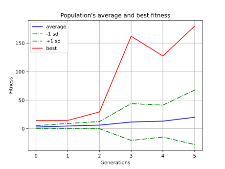
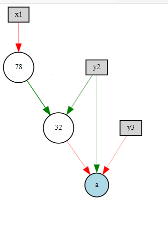

# RESULT

Description: 

The following content shows the performance of Flappy Bird based on NEAT algorithm at different latitudes and some comparation between ql and neat .

Controllable parameters: speed, barrier clearance, refresh rate(FPS), number of birds per generation, number of generations

With the help of my teammate Qin , we improved the difficulty of the game. For example, we increase the randomness of the gap position between the upper and lower pipes and appropriately reduce gap size.
This is the process of training.

Here we control for the same other variables, looking at the performance of the obstacle gap for the bird over the obstacle

|      | avg_fitness              | speciation                |
| ---- | ------------------------ | ------------------------- |
| 70   |   |   |
| 80   |   |   |
| 90   |   |   |
| 100  |  |  |

It was found that neat_Flappy_bird's fitness increased as the gap increased and the difficulty of the game decreased.

When the gap value was only 70, the fitness of the best birds in the thirtieth generation was only 55, while the average fitness of birds in the thirtieth generation remained around 8

When the gap value is added to 80 and 90, the maximum value has reached 340 and 700 respectively, and the average value is 70 and 140

When the gap rose to 100, the fitness of the best birds reached an unprecedented 1,750 or more, and the average was above 100

Vertical comparison shows that the strategy of simply increasing the gap value reduces the difficulty of implementation, which can make neat_Flappy_bird's performance get better and better, and its fitness degree is also greatly improved

Just take one of the graphs for analysis and you can see:

Both the optimal performance of each generation and the average performance of all birds showed a marked increase in fitness as the algebra increased.

However, when contemporary algebra is large (&gt; =15), we found unexpected fluctuations in fitness

Analyzing the reasons for this, we think it's because of game mechanics

Since the generation of obstacles is random, there may be such a situation: the first group of obstacles appears at the top of the interface, while the second group of obstacles appears at the bottom of the interface. One of our attributes to a bird is that it may not be falling fast enough to avoid obstacles.

For a wise bird, it might need to learn to brush the bottom of an obstacle every time it avoids it to make sure it avoids it as much as possible

So we studied the bird representation based on the relative speed of the bird and the obstacle, to explore at what speed the bird can learn to avoid the obstacle as intelligently as possible. The expectation is that the slower the bird is, the more likely it is to avoid the obstacle. Does the result meet the expectation?

|      | avg_fitness          | speciation            |
| ---- | -------------------- | --------------------- |
| 4    |  |  |
| 6    |  |  |
| 8    |  |  |

Indeed, as it turns out, the faster we found, the worse the performance of the birds, the faster the birds were, the more difficult the birds were, and the higher the speed, the more random the event: the unsurmountable obstacle, the collective death of a certain generation of birds. In the course of the game, it can also be observed that the reason for the collective death of a certain generation of birds and their poor performance is the occurrence of the above impassable obstacles

There is a second column in the table about the two groups shown earlier: Speciation

The previous student QIN has talked about variation in the algorithm part of our project. We found that as the difficulty increased, more species appeared, and more patches of color appeared on the diagram. That is to say, the increase of difficulty promotes the occurrence of mutation, and the proportion of specie obtained by new mutation also increases.

In addition to these dimensions, we also conducted experiments on the influence of the number of generations and the number of birds in each generation on the experiment. The original data obtained from the experiment were retained in the project and uploaded to the network, and the cause of the event was not displayed.

With the same limited training time, THE QL_bird can traverse all situations, It learns to stick to the lower edge of the obstacle, free from random obstacles, and eventually produce a very good model. With high efficiency, NEAT achieves far better results than Qlearning in the early stage. However, it is still affected by randomness. However, limited by time and parameters we set, maybe we did not achieve the best effect of NEAT project. BUT After parameter adjustment, our NEAT_bird can also quickly get a model and finally get a high score.

In addition, The NEAT bird is more adaptable than the QL bird when the difficulty increases. The QL bird needs to update the Q table slowly, and Neat quickly adapts and performs well

On the left is the post-neat training process. In the middle is a single test of a bird selected by NEAT. On the right is a single test of a bird selected by QL.

Comparing the two flight attitudes, we found that the above conjecture is true.

After all, We added SAVE and LOAD functions to SAVE the optimal model, which enabled our training to be carried out in stages and greatly improved the effect of our cooperative training. Finally, through continuous training and screening, our final model could get a high score and the high score of 1000 was achieved in the end. 

In the future exploration, we will try to use more algorithms, such as PPO mentioned in the first group, to optimize, improve and compare our AI_flappy_bird.

Through the experience of this project, we have mastered some knowledge of deep learning and improved the ability of the project. Thanks for the guidance of teachers and teaching assistants