# RESULT

|      | avg_fitness              | speciation                |
| ---- | ------------------------ | ------------------------- |
| 70   | 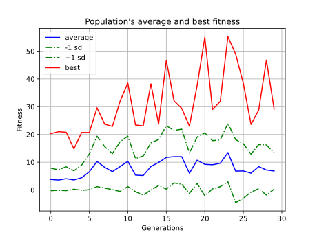  |   |
| 80   | 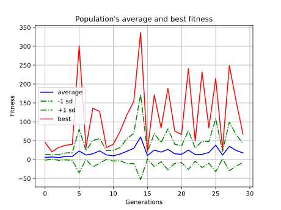  |   |
| 90   | 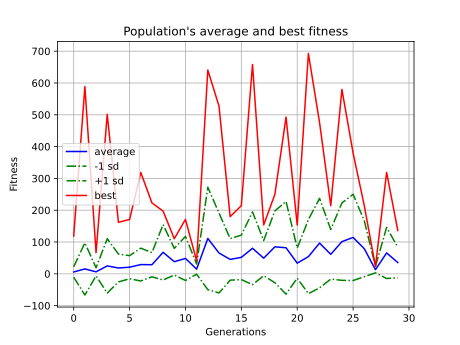  | 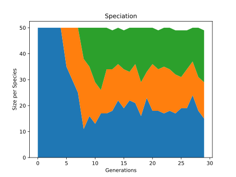  |
| 100  | 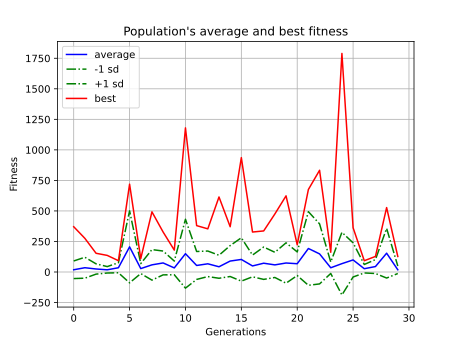 | 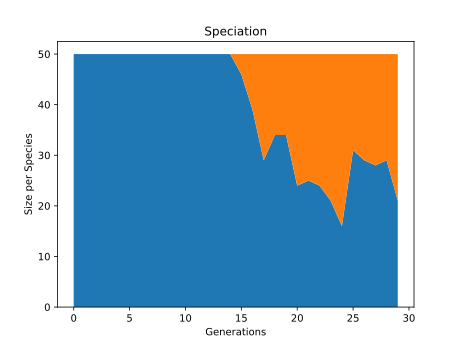 |

|      | avg_fitness          | speciation            |
| ---- | -------------------- | --------------------- |
| 4    | 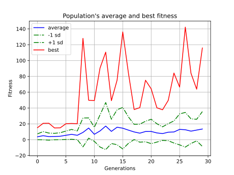 | 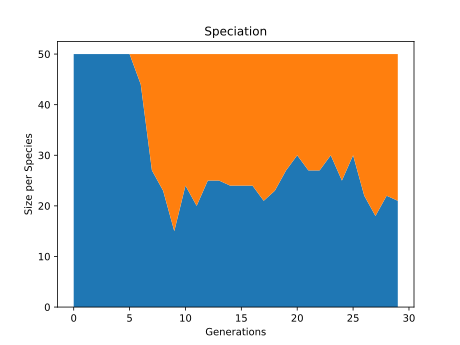 |
| 6    | 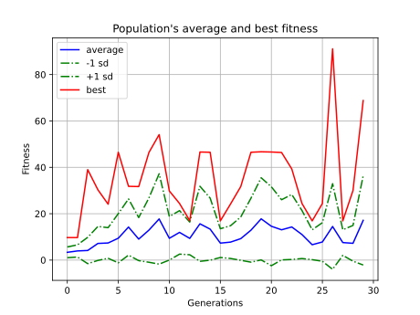 | 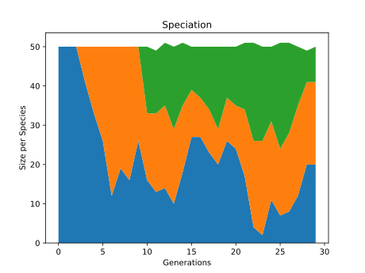 |
| 8    | 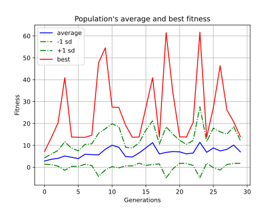 | 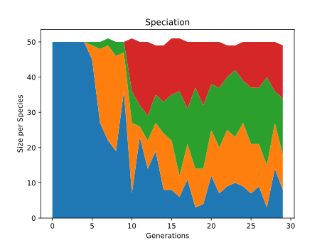 |

